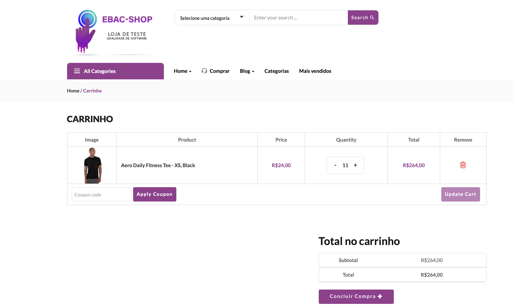

# BUG-002 – 10% coupon not applied for cart totals between R$ 200 and R$ 600

| Field | Value |
|---|---|
| **Severity** | Major |
| **Priority** | Medium |
| **Status** | Needs clarification |
| **Environment** | Local (Docker) – `http://localhost` |
| **Related** | US-0001 · TC-001-06 |

## Description
A cart totaling R$ 264,00 does not receive the 10% coupon defined in US-0001.

## Steps to Reproduce
1. Add 11 units of "Aero Daily Fitness Tee" (R$ 24,00 each) to the cart.
2. Open the cart.

## Expected Result
A 10% discount is applied (total R$ 237,60).

## Actual Result
No discount is applied (total R$ 264,00).

## Evidence

## Notes
The business rule says carts "ganham cupom de 10%", which could also mean a coupon
code delivered for a future purchase. Confirmation from the PO is needed before
this is treated as a confirmed defect.