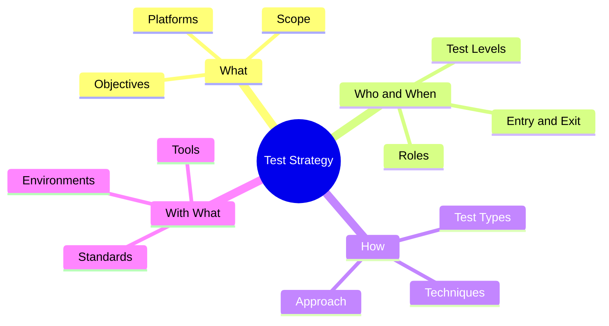

# Software Quality Engineer – Final Project

**Quality Analysis of the EBAC Shop E-commerce**

Kevin Fonseca · 2026

Repository: [github.com/sorkevinick/ecommerce-qa-automation](https://github.com/sorkevinick/ecommerce-qa-automation)

---

## Abstract

This project applies the full workflow of a Quality Engineer to EBAC Shop, a WooCommerce-based e-commerce store, from planning to delivery. It starts with a test strategy, followed by acceptance criteria written in Gherkin for nine user stories and 51 test cases designed with techniques such as boundary value analysis, decision tables and state transition. Test automation covers three layers: web UI with Playwright and TypeScript across Chromium, Firefox and WebKit; the coupons REST API with Supertest and contract validation using Joi; and the Android store management app with WebdriverIO and Appium. All web and API suites run automatically on GitHub Actions, using a script that seeds realistic test data through the store's API. Load tests with k6 evaluated login and catalog browsing under 20 concurrent users. The work uncovered three defects, including required fields not validated by the coupons API, as well as accessibility and internationalization issues. It also documents the investigation of several flaky tests and one false positive, reinforcing that reliable automation depends as much on test design as on tooling.

---

## Table of Contents

1. [Introduction](#1-introduction)
2. [The Project](#2-the-project)
   - 2.1 [Test Strategy](#21-test-strategy)
   - 2.2 [Acceptance Criteria](#22-acceptance-criteria)
   - 2.3 [Test Cases](#23-test-cases)
   - 2.4 [GitHub Repository](#24-github-repository)
   - 2.5 [Automated Tests](#25-automated-tests)
   - 2.6 [Continuous Integration](#26-continuous-integration)
   - 2.7 [Performance Tests](#27-performance-tests)
3. [Defects and Findings](#3-defects-and-findings)
4. [Conclusion](#4-conclusion)
5. [References](#5-references)

---

## 1. Introduction

EBAC Shop is a test e-commerce store built on WordPress and WooCommerce, used throughout the Software Quality Engineer program. It offers a product catalog, shopping cart, checkout, customer account area and a REST API, and it is managed by store staff through the WooCommerce Android app.

The goal of this project was to act as the Quality Engineer of an agile team responsible for this store: to plan how quality would be assured, refine the user stories with testable acceptance criteria, design test cases, automate the most valuable ones at the right level of the test pyramid, run them continuously, and assess the store's behavior under load.

Two principles guided the work. The first was **exploring before automating**: every automated test was preceded by manual exploration of the real system, which revealed behaviors that no specification described. The second was **treating test reliability as a deliverable**: a test that passes for the wrong reason, or fails at random, costs the team more than it saves. Much of the effort described here went into making the suites trustworthy.

The whole project was written in English and published as a public repository, so that it can be read and executed by anyone.

---

## 2. The Project

### 2.1 Test Strategy

The strategy was documented as a mind map, written in Mermaid so that it renders directly on GitHub and stays versioned with the code. It is organized into four pillars:

- **What:** validate business rules, prevent regressions, ensure performance and provide fast feedback. The scope covers the web store, the REST API and the Android app; real payment processing and email delivery are out of scope.
- **Who and When:** the QE plans, designs and automates tests; developers write unit tests; the Product Owner accepts stories. Tests span the unit, integration (API), system (E2E) and acceptance levels, with explicit entry and exit criteria.
- **How:** functional, regression, smoke, contract and performance testing, using equivalence partitioning, boundary value analysis, decision tables, state transition, error guessing and exploratory testing. Critical and repetitive scenarios are automated; exploratory and rare scenarios stay manual.
- **With What:** Playwright + TypeScript (UI), Supertest + Jest (API), WebdriverIO + Appium (mobile), k6 (performance), GitHub Actions (CI), Docker (environment).

Full strategy: [docs/test-strategy.md](test-strategy.md).

### 2.2 Acceptance Criteria

The three refined user stories provided by the program (add to cart, login and coupons API) received acceptance criteria in Gherkin, using `Scenario Outline` tables to express boundary values. Five new user stories were written for the product catalog, account dashboard, orders, addresses and account details, and a ninth story was created for the Android app.

Two practices stand out:

- **Open questions:** ambiguous rules were recorded instead of assumed. For example, US-0001 states that totals "between R$ 200 and R$ 600" receive a 10% coupon, without saying whether R$ 600 receives 10% or 15%.
- **Rules grounded in exploration:** the new stories were written after exploratory sessions in the store, and each one states that its rules were inferred from observed behavior, since no formal specification existed. This exploration also revealed that the Android app is a **store management** app, so its story was written for a different persona (the store manager) instead of reusing the customer-facing catalog story.

User stories: [docs/user-stories](user-stories).

### 2.3 Test Cases

51 test cases were designed, each with type (happy path, alternative or negative), technique, priority, preconditions, steps, test data and expected result. Examples of techniques applied:

| Technique | Example |
|---|---|
| Boundary value analysis | Cart quantity of 10 and 11 units; totals of R$ 199.99, R$ 200.00, R$ 600.00 and R$ 600.01; postcodes with 7, 8 and 9 digits |
| Decision table | Add-to-cart button behavior for each size/color combination; coupon creation with each required field omitted |
| State transition | Account lock after three failed login attempts |
| Error guessing | Accessing another customer's order by URL (IDOR) |

Each case was classified for automation using three criteria: **critical, repeatable and stable**. Cases stayed manual when they depended on time (a 15-minute lock), on data prepared in the admin panel, or when automating them would change shared test data (such as changing the test user's password). The result was 34 automated and 17 manual test cases.

Coverage summary: [docs/test-cases/README.md](test-cases/README.md).

### 2.4 GitHub Repository

The repository is organized by test layer, with documentation kept alongside the code:

| Folder | Content |
|---|---|
| `UI/` | Playwright tests |
| `API/` | Supertest tests and contract schemas |
| `Mobile/` | WebdriverIO and Appium tests |
| `performance/` | k6 load tests |
| `docs/` | Strategy, user stories, test cases, bug reports and reports |
| `.github/` | CI workflow and setup scripts |

Commits follow the Conventional Commits standard. Credentials are never committed: each project reads them from a local `.env` file, and CI reads them from GitHub Secrets.

### 2.5 Automated Tests

#### UI Automation

**Tool choice.** Selenium WebDriver, Cypress and Playwright were compared on languages, browser support, waiting strategy, multi-tab support, parallelism, debugging, reporting and learning curve. Playwright with TypeScript was chosen for its consistency with the rest of the stack, real WebKit coverage, free built-in parallelism, and its trace viewer and HTML report. The full comparison is in [docs/ui-tool-comparison.md](ui-tool-comparison.md).

**Design.** The suite uses the **Page Object Model**, with one class per page (login, product, cart, catalog, checkout, orders, addresses and account details). Test data lives in separate files, and data-driven tests turn decision tables directly into test cases. Login runs once and its session is reused (`storageState`) only by tests that need it; logout and purchase tests use their own sessions to stay isolated. Known defects are tracked in code with `test.fail()`, linked to their bug reports.

**Result.** 23 test cases (33 tests including data-driven variations) run on Chromium, Firefox and WebKit, including a full end-to-end purchase flow: registration, add to cart, checkout and order history.

**Reliability work.** Running the suite on three browsers exposed several flaky tests. Each was investigated with screenshots, traces and repeated runs (`--repeat-each`), and all shared the same root cause: **the test acted before the page had finished preparing itself**. Examples include a password strength library loaded in the background that blocked registration, checkout fields reset by background initialization, and a product variation click lost before the page scripts were ready. The fixes replaced fixed assumptions with waits for real states and added assertions immediately after each action, so that failures became fast and explicit.

#### API Automation

The coupons API (US-0003) was first explored with `curl` to observe real status codes and response bodies, and then automated with **Supertest and Jest**. Key practices:

- **Contract validation** with Joi schemas for coupons, coupon lists and errors, validating types and required fields while allowing new fields to be added without breaking the tests.
- **Test data factory** that generates coupons with unique codes, so tests never collide.
- **Setup and cleanup:** the tests create the data they need and delete every coupon they create.

The suite runs 10 tests in under 3 seconds. Its data-driven test for required fields revealed that the API only validates the coupon code (BUG-003).

#### Mobile Automation

The Android app was automated with **WebdriverIO and Appium (UiAutomator2)**, using the Screen Object pattern and selectors discovered with Appium Inspector, preferring accessibility IDs and product names over list positions.

Because the app connects to the online store shared by all program students, whose data changes at any time, the tests rely only on stable data: a known product and the behavior of the search, never on list order, product count or stock levels.

A notable finding came from this suite: the search test initially passed because it found the product name inside the **search field itself**, not in the results. It was a false positive, revealed when a related test failed. After the fix, the test was deliberately forced to fail with a non-existent product to prove it could detect a real failure.

**Reports.** Playwright generates an HTML report, the API suite generates an HTML report with jest-html-reporters, and the mobile suite generates an Allure report.

### 2.6 Continuous Integration

A GitHub Actions workflow runs on every push and pull request, with two parallel jobs:

| Job | Steps |
|---|---|
| **API tests** | Start the store in Docker, install dependencies with `npm ci`, run the Supertest suite and publish the report |
| **UI tests** | Start the store, seed test data, type-check the project, install browsers, run Playwright on three browsers and publish the report |

Since CI starts from a fresh store on every run, a **seeding script** creates the test customer and a realistic order through the WooCommerce API. The first CI run showed why realism matters: an order seeded without a payment method made a test fail, because the store only displays that field for orders that have one.

Mobile tests are intentionally kept out of CI: Android emulators are slow and unreliable in CI environments, and the app depends on a shared online store whose data changes independently of this project.

### 2.7 Performance Tests

Two scenarios were implemented with **k6**, using the load profile defined by the program: 20 virtual users, 2 minutes, 20-second ramp-up, and five test users. The tests ran against the local store only, never against the shared online environment.

Each test has explicit acceptance criteria (thresholds): less than 1% failed requests, 95th-percentile response time under 3 seconds and more than 99% of functional checks passing. Every response is also verified functionally; for example, the login test confirms that the account dashboard is shown, since a failed login page also returns status 200.

| Metric | PERF-01: Login | PERF-02: Catalog |
|---|---|---|
| Failed requests | 0% | 0% |
| p(95) response time | 247 ms | 306 ms |
| Thresholds | ✅ Passed | ✅ Passed |

The store handled the load without errors, and catalog pages proved about 40% slower than login, making them the first candidate for optimization. Since the local store ran under x86 emulation, the results are valid for comparison rather than as absolute production figures. A stress test is recommended to find the breaking point. Full analysis: [docs/performance/performance-test-report.md](performance/performance-test-report.md).

---

## 3. Defects and Findings

| ID | Summary | Found by |
|---|---|---|
| [BUG-001](bugs/BUG-001-quantity-limit-not-enforced.md) | The store accepts more than 10 units of the same product | Exploratory testing, confirmed by automation |
| [BUG-002](bugs/BUG-002-coupon-not-applied.md) | 10% coupon not applied to totals between R$ 200 and R$ 600 (pending PO clarification) | Exploratory testing |
| [BUG-003](bugs/BUG-003-coupon-required-fields-not-validated.md) | The coupons API accepts coupons without `amount`, `discount_type` and `description` | Data-driven API test |

Other findings recorded in the user stories:

- **Accessibility (WCAG 1.1.1):** product images in the catalog have no alternative text.
- **Internationalization:** the interface mixes Portuguese and English labels, and the sorting dropdown's accessible label is a mistranslation ("Pedido da loja").
- **Visual consistency:** one button uses a different color from the rest of the store.
- **Undocumented behaviors:** single-result searches redirect to the product page; coupon codes are stored in lowercase; the app search also matches fields other than the product name.

---

## 4. Conclusion

This project brought together, in a single deliverable, every stage of a Quality Engineer's work, and the most valuable lessons came from the moments when things did not work as expected.

The first lesson was that **exploration comes before automation**. Recording the flows before writing Page Objects, calling the API with `curl` before writing assertions, and inspecting the app before writing Screen Objects revealed behaviors that no user story described, from a search that redirects when it finds a single product to an app built for a completely different persona.

The second lesson was that **a green test is only valuable if it can turn red**. Investigating flaky tests showed that most failures in UI automation come from timing: the test moving faster than the page. The false positive in the mobile search test showed the opposite risk, a test that could never fail. Both changed the way I write assertions: verifying the state right after each action, and confirming that each test can detect a real failure.

The third lesson was about **reproducibility**. Moving the suites to CI exposed hidden dependencies, such as data I had created by hand and dependency versions that only worked on my machine. Seeding data through the API and using `npm ci` made the results the same on any machine.

---

## 5. References

APPIUM. **Appium Documentation**. Available at: https://appium.io/docs/. Accessed on: Sep. 26, 2026.

GITHUB. **GitHub Actions Documentation**. Available at: https://docs.github.com/actions. Accessed on: Sep. 26, 2026.

GRAFANA LABS. **k6 Documentation**. Available at: https://grafana.com/docs/k6/. Accessed on: Sep. 26, 2026.

INTERNATIONAL SOFTWARE TESTING QUALIFICATIONS BOARD (ISTQB). **Certified Tester Foundation Level Syllabus**. Available at: https://www.istqb.org/. Accessed on: Sep. 26, 2026.

JOI. **Joi API Documentation**. Available at: https://joi.dev/api/. Accessed on: Sep. 26, 2026.

MICROSOFT. **Playwright Documentation**. Available at: https://playwright.dev/docs/intro. Accessed on: Sep. 26, 2026.

SUPERTEST. **Supertest Repository**. Available at: https://github.com/ladjs/supertest. Accessed on: Sep. 26, 2026.

W3C. **Web Content Accessibility Guidelines (WCAG) 2.2**. Available at: https://www.w3.org/TR/WCAG22/. Accessed on: Sep. 26, 2026.

WEBDRIVERIO. **WebdriverIO Documentation**. Available at: https://webdriver.io/docs/gettingstarted. Accessed on: Sep. 26, 2026.

WOOCOMMERCE. **WooCommerce REST API Documentation**. Available at: https://woocommerce.github.io/woocommerce-rest-api-docs/. Accessed on: Sep. 26, 2026.
