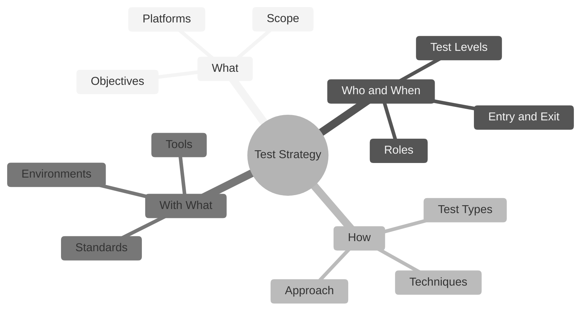

# Test Strategy – EBAC Shop

## Overview

## What

| Item | Details |
|---|---|
| **Objectives** | Validate the business rules of each user story, prevent regressions through automation, ensure performance under load, and provide fast feedback through CI. |
| **In scope** | US-0001 Add item to cart, US-0002 Login, US-0003 Coupons API, Product Catalog, My Account, Orders, Addresses, Account Details. |
| **Out of scope** | Real payment processing and email delivery. |
| **Platforms** | Web, REST API, Mobile (Android). |

## Who and When

| Item | Details |
|---|---|
| **Roles** | **QE:** plans, designs and automates tests. **Developers:** write unit tests and fix bugs. **Product Owner:** defines and accepts user stories. |
| **Test Levels** | Unit (developers), Integration (API), System (E2E on Web and Mobile), Acceptance (BDD scenarios). |
| **Entry Criteria** | User story refined with acceptance criteria; test environment up and running. |
| **Exit Criteria** | All critical test cases passed; no open blocker or critical bugs. |

## How

| Item | Details |
|---|---|
| **Test Types** | Functional, Regression, Smoke, Contract, Performance. |
| **Techniques** | Equivalence Partitioning, Boundary Value Analysis, Decision Table, State Transition, Error Guessing, Exploratory Testing. |
| **Approach** | **Manual:** exploratory testing and new features. **Automated:** regression and critical paths. |

## With What

| Item | Details |
|---|---|
| **Tools** | Playwright + TypeScript (UI), Supertest + Jest (API), WebdriverIO + Appium (Mobile), k6 (Performance), GitHub Actions (CI), Allure (Reports). |
| **Environments** | Local with Docker; QA on the EBAC hosted store. |
| **Standards** | Gherkin for acceptance criteria, Page Object Model, Conventional Commits. |